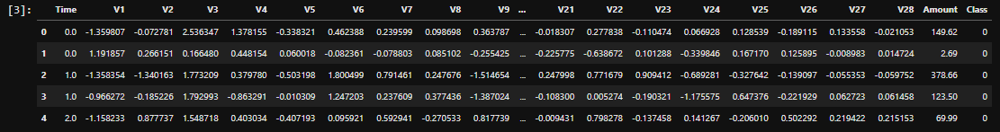
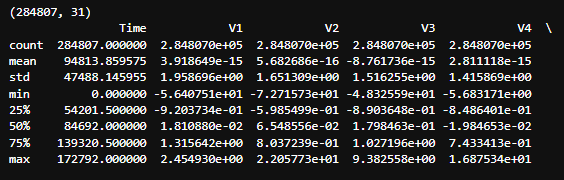
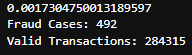
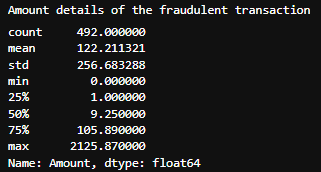
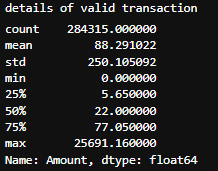
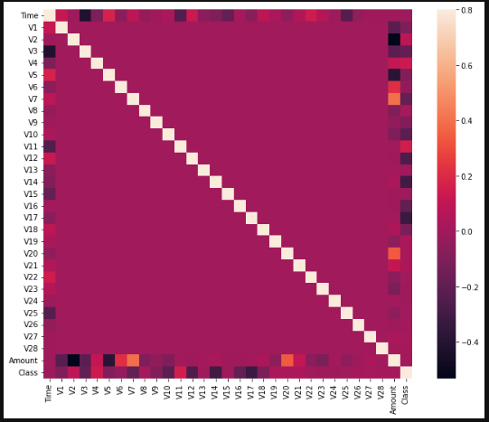
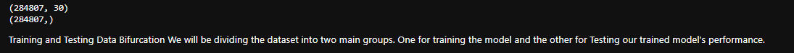
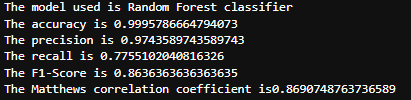
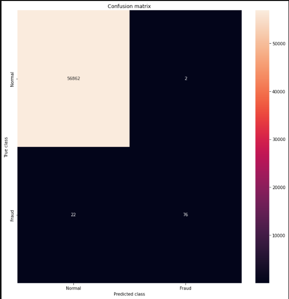
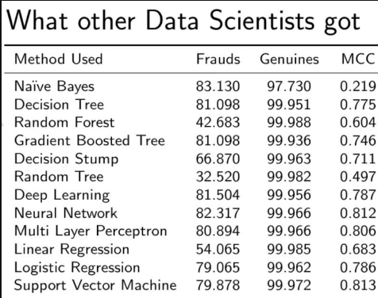

# Fraud-Detection
Recognize fraudulent credit card transactions

The challenge is to recognize fraudulent credit card transactions so that the customers of credit card companies are not charged for items that they did not purchase.

The model used must be simple and fast enough to detect the anomaly and classify it as a fraudulent transaction as quickly as possible.
Imbalance can be dealt with by properly using some methods which we will talk about in the next paragraph
For protecting the privacy of the user the dimensionality of the data can be reduced.
A more trustworthy source must be taken which double-check the data, at least for training the model.
We can make the model simple and interpretable so that when the scammer adapts to it with just some tweaks we can have a new model up and running to deploy.

1. **Importing all the necessary Libraries**
3. **Loading the Data**

5. **Understanding the Data**
6. **Describing the Data** 

8.  **Imbalance in the data**

Only _0.17%_ fraudulent transaction out all the transactions. The data is highly Unbalanced. Lets first apply our models without balancing it and if we don’t get a good accuracy then we can find a way to balance this dataset. But first, let’s implement the model without it and will balance the data only if needed.
6. **Print the amount details for Fraudulent Transaction**

8. **Print the amount details for Normal Transaction**

As we can clearly notice from this, the average Money transaction for the fraudulent ones is more. This makes this problem crucial to deal with.
8. **Plotting the Correlation Matrix**

The correlation matrix graphically gives us an idea of how features correlate with each other and can help us predict what are the features that are most relevant for the prediction.
In the HeatMap we can clearly see that most of the features do not correlate to other features but there are some features that either has a positive or a negative correlation with each other. For example, _V2_ and _V5_ are highly negatively correlated with the feature called _Amount_. We also see some correlation with _V20_ and _Amount_. This gives us a deeper understanding of the Data available to us.
9. **Separating the X and the Y values**

Dividing the data into inputs parameters and outputs value format
10. **Training and Testing Data** We will be dividing the dataset into two main groups. One for training the model and the other for Testing our trained model’s performance.
11. **Building a Random Forest Model using skicit learn**
12. **Building all kinds of evaluating parameters**

14. **Visualizing the Confusion Matrix**

16. Comparison with other algorithms without dealing with the imbalancing of the data.

As you can see with our Random Forest Model we are getting a better result even for the recall which is the most tricky part. 
